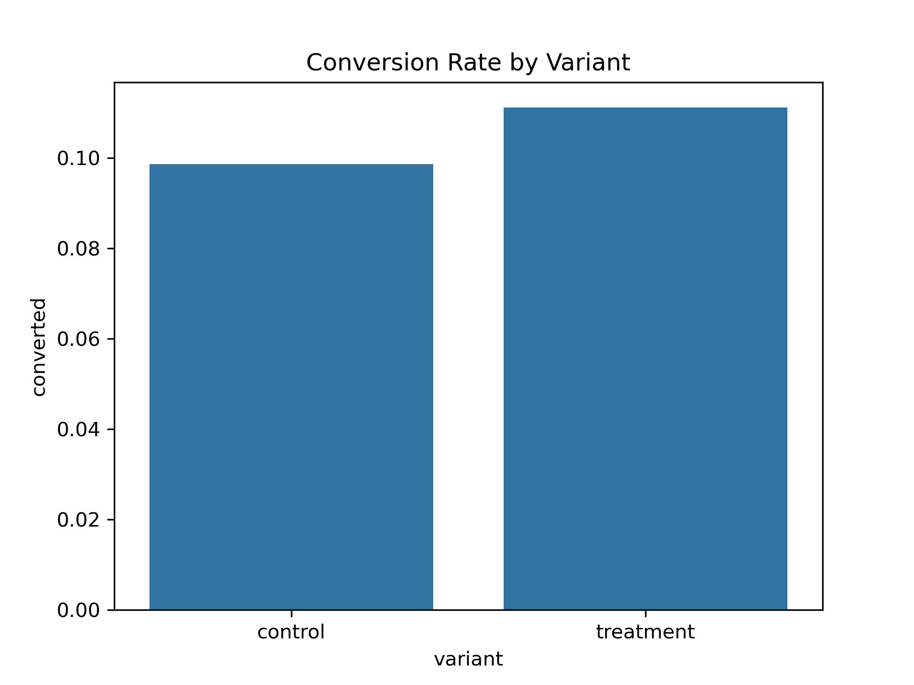
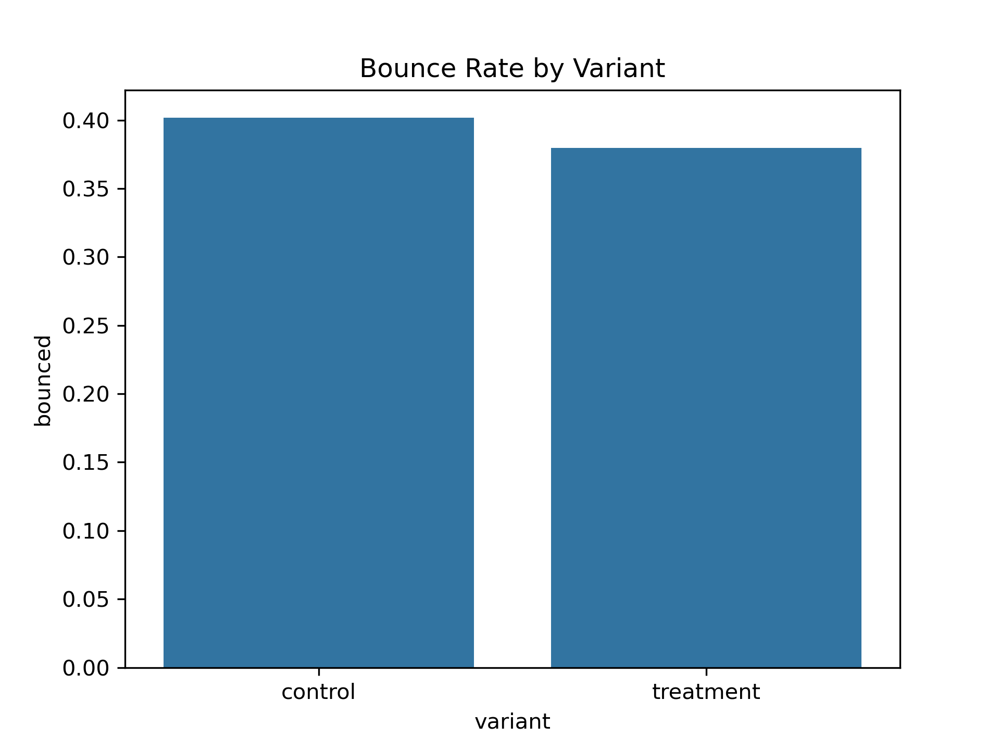
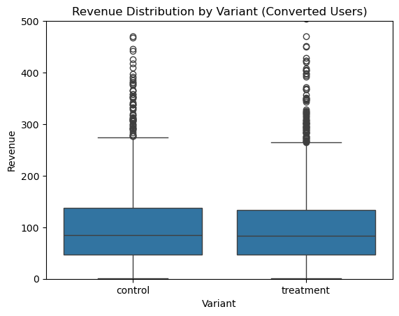

# Website Conversion A/B Testing

**Experimentation & Causal Thinking Project**  

This project simulates a real-world A/B test for a website landing page, analyzing the impact of a new design on user conversion, bounce rate, and revenue. It demonstrates end-to-end experimentation, statistical testing, and business decision-making.

---
## Business Problem

We want to determine whether a **new landing page design** increases the **conversion rate** for new users on an e-commerce website. The experiment supports the decision: **ship, iterate, or stop**.

- **Primary metric:** Conversion rate (purchase completed)  
- **Secondary metrics:** Bounce rate, Revenue per user (RPU)

---

## Experiment Design

- **User population:** New website visitors (bots and internal traffic excluded)  
- **Randomization:** User-level, sticky assignment  
- **Groups:**  
  - Control: Existing landing page  
  - Treatment: New landing page  
- **Sample size:** 50,000 users (50% control / 50% treatment)  
- **Simulated treatment uplift:** +1.5% absolute conversion increase  
- **Revenue distribution:** Simulated using realistic gamma distribution  

---

## Data Validation

- Checked for duplicate user IDs  
- Verified randomization balance between groups  
- Confirmed no missing values  
- Ensured metrics are in valid ranges  

---

## Primary Metric Analysis

### Conversion Rate by Variant

- **Control:** 10%  
- **Treatment:** 11.5%  
- **Absolute uplift:** 1.5%  
- **Statistical test:** One-sided z-test, p-value < 0.05 → significant  

---

## Secondary Metrics

### Bounce Rate by Variant

- **Control:** 40%  
- **Treatment:** 38%  

### Revenue Distribution for Converted Users

- **Control Avg Revenue:** \$98.5  
- **Treatment Avg Revenue:** \$100.2  

---

## Decision

- Conversion rate uplift is statistically significant  
- Bounce rate decreased slightly  
- Revenue per user slightly increased  

**Recommendation:** **Ship the new landing page**

---

## Visualizations

All key plots are included in the `reports/` folder:

- Conversion Rate Bar Plot → `conversion_barplot.png`  
- Bounce Rate Bar Plot → `bounce_barplot.png`  
- Revenue Distribution Box Plot → `revenue_boxplot.png`  

---

## Notes

- Data is **simulated** to reflect realistic A/B test behavior  
- Analysis is **fully reproducible** via the provided notebooks  
- Follows **industry-standard experimentation practices** for product analytics.